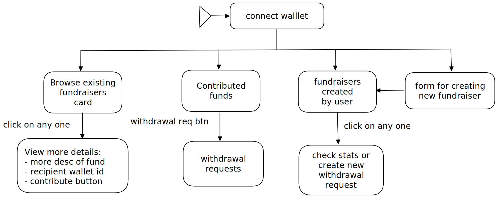
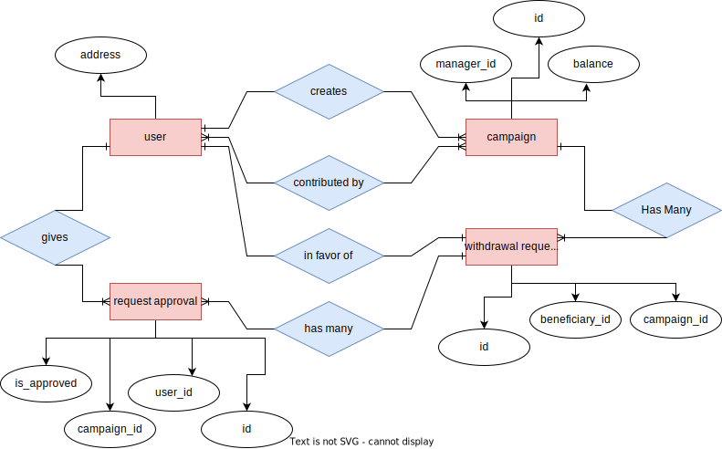

 

    
    

<h2 align="center">Etherfunds</h2>

  Blockchain based Fundraising platform, that eliminates middlemen while maintaining the integrity of the entire process.
   
   
  <a href="#table-of-content"><b>Explore the docs »</b></a>
   
   
  <a href="#architecture">Architecture</a>
  &nbsp;&nbsp;·&nbsp;&nbsp;
  <a href="#pages">Pages</a>
  &nbsp;&nbsp;·&nbsp;&nbsp;
  <a href="#local-setup">Local Setup</a>
   

 

**Demo Video will be added here**

### Table Of Content

- [Architecture](#architecture-and-design)
- [Pages and description](#pages)
- [Technologies Used](#technologies-used)
- [Local Setup](#local-setup)
- [License](#license-)
- [Authors](#authors)

 

### Problem we are trying to solve?

When deciding about donating funds to charitable causes, many will wonder whether or not their contribution will have an impact. Quite a lot of nonprofit organizations have shaken people’s trust in philanthropy and made them question the credibility of charity initiatives by engaging in shady schemes to extract more revenue. Transparency is one of the key issues in today’s philanthropic world.
 
Enter blockchain technology, an immutable ledger where every record can be traced to its creation. Decentralized and distributed among its users, blockchain allows them to track transactions and be sure of the absence of fraudulent activities.
 

**Problems with the exisiting sytem?**

Let's explore the core problems of existing fundraising platforms
- When supporting a nonprofit is merely a click away, we may accidentally end up funding fraudulent campaigns resulting in [news like these](https://www.justice.gov/usao-ndga/pr/operator-bogus-charity-sentenced-defrauding-multiple-companies).
- Even with legitimate charitable organizations, some of these charities only allocate a small portion of their donations to the actual cause and the remaining goes to corporate sponsors and private operators.

Our PS poses to develop an application that can automate transactions in a secured way and some more falana.

**Why Blockchain?**

**Why only Ethereum Blockchain**
 
- The currency of Ethereum network is Ether which is a well established cryptocurrency. These days there are many new cryptocurrencies Scam Initial Coin Offerings(ICO) are completely fabricated, with fake bios of nonexistent team members and technical whitepapers
- The community of developers which would help us in bug resolution

**Main Unsolved Question**
 

1) What if owner of fund is not a legitimte person and uses the fund for his own benefits after withdrawal.
- The current sol will offer immutablility of transactions and peer-to-peer will help eliminating distribution of money among middle men 
- A counter thought would be to have sepearte admin interface which stores the personal details of fund creator along with their wallet address 

2) What if owner is a NGO and then they distribute money to management as well as to the cause, but they majorly used their funds for management, can you do something about it? 

one of the probable ans:  
A safety and trust team could be created to verify personal information, the identity of recipients, and they make sure that all funds raised on Etherfunds are going to the right place. They work closely with state and local officials and law enforcement to assist in any investigations.
The goal is to automate the process with least human interactions therby eliminating any chances of malpractice during transaction and establishing a P2P network

## Architecture 

We tried to follow ideal Software Development Design Principles such as.
- Do not repeat yourself (DRY)
- Keep it short and simple (KISS)
- You Ain’t Gonna Need It (YAGNI)

 

The presentation for Etherfunds can be found [here](https://www.canva.com/design/DAE3pEWUc1Y/Lrnk-dxztwBzIL4UkxrQvg/view#1).

### Block diagram

- The block diagram shows the overview of the system.
 

 

### Use-case diagram

- The use case shows the workflow in detail

### E-R diagram

- ER diagram shows the databases involved

 

 

## Pages

## Technologies Used

 

- Workflow and Architecture Design
  - Excalidraw | Draw.io
- Frontend
  - React.js and related packages
  - CSS and related packages
- Blockchain network: Ethereum
- Smart contracts are written in **Solidity** programming language
- Smart contracts compilation and deployment to test network was done using **Hardhat**
- Blockchain wallet used: **MetaMask** 

 

## Local-Setup

1. clone the project to your local environment
2. make sure you have node.js version ^14.19.0
3. make sure you have npm version ^8.5.5
4. run `$ npm install` to install dependencies for react app
5. run `$ cp .env.example .env.development.local`
6. run `$ cd src/backend` to cd into the backend directorry
7. run `$ npm install` to install dependencies for the backend
8. open two terminals in one terminal run `$ npx hardhat node` to start a local blockchain
9. in second terminal run `$ npx hardhat run --network localhost scripts/deploy_etherfund.js` to deploy the smart contract and copy the address printed in the terminal
10. open the `.env.development.local` file from project root and set the variable `REACT_APP_CONTRACT_ADDRESS` to the address copied above
11. run `$ cd ../..` to go back to the project root and run `$ npm start` to start the react project

### License 📜

[GNU General Public License v3.0](/LICENSE)

### Authors

- Aniket More
    - [LinkedIn](https://www.linkedin.com/in/aniket-more-2b97571b1/) | [Twitter](https://twitter.com/aniket_more311) 
 - Chirag Mahajan
    - [Linkedin](https://www.linkedin.com/in/chirag-mahajan-b09144137/) | [GitLab](https://gitlab.com/chiragmahajan3101)
 - Shyren More
    - [LinkedIn](https://www.linkedin.com/in/shyrenmore/) | [Gmail](mailto:shyren.more30@gmail.com)
